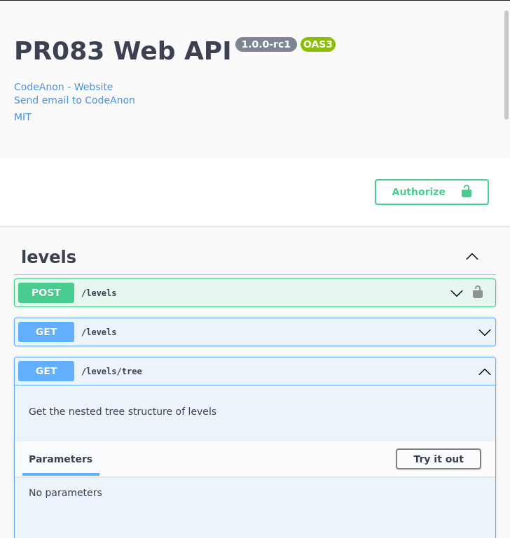

# pr083 Web API

This is the backend to the `pr083` minigame, where you are playing as the in-flight computer of a space probe. Your goal is to visit all stars in the alloted fuel and time, and your only control is with a list of control thruster sequences.

This was made as the backend for a web frontend development workshop at CodeAnon.



# Contributing

## Installation

```bash
$ pnpm install
```

## Running the app

```bash
# development
$ pnpm start

# watch mode
$ pnpm start:dev

# production mode
$ pnpm start:prod
```

## Test

```bash
# unit tests
$ npm run test

# e2e tests
$ npm run test:e2e

# test coverage
$ npm run test:cov
```
